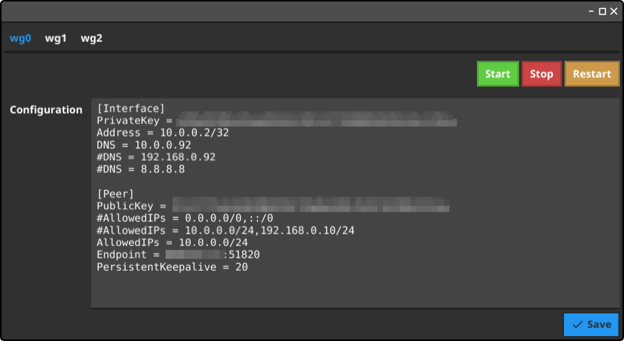

# Wireguard GUI

Wireguard GUI is a graphic tool that helps you to edit existing confs of Wireguard.




## Requirements

Wireguard GUI reads `/etc/wireguard/*.conf` and uses `wg-quick` to manage interfaces.

## Installation

### From sources

```
git clone https://gitnet.fr/deblan/wireguard-gui.git
cd wireguard-gui
make
```

### From binaries

Builds are available for Linux (64 bits).

Download the latest binary from [releases](https://gitnet.fr/deblan/wireguard-gui/releases).

## Usage

```
sudo ./build/wireguard-gui-amd64
```
